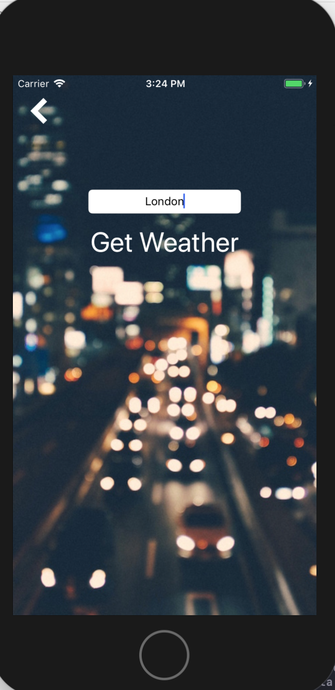

# WeatherAppSwift

Launch screen is this view controller. It shows an icon with the current weather conditions as well as the current temperature with a toggle to choose between C and F. 

We navigate to the next screen. It has this view controller with an option to type in any city and when clicking on the button it will navigate us to the next view controller with the city's weather information

You can get an APP ID token from api.openweathermap.org and just paste it in the WeatherViewController class where you'll find "YOUR APP ID HERE" so you can fetch data from the API. 

